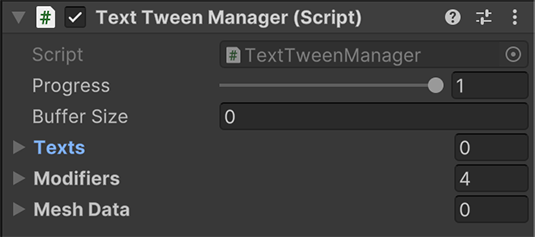
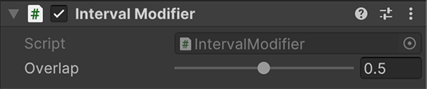
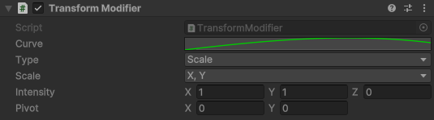
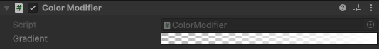
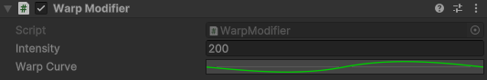

# TextTween

**TextTween** is a lightweight Unity library designed to animate [TextMesh Pro (TMP)](https://docs.unity3d.com/Packages/com.unity.textmeshpro@latest) texts with high performance. It leverages Unity's **Job System** and **Burst Compiler** to deliver smooth and efficient character-level animations.

## ✨ Features

- 🚀 High-performance character animation using **Jobs** and **Burst**
- 🔠 Fine-grained control over individual TMP characters
- 🎮 Easy to integrate into existing Unity projects
- 🧩 Lightweight and dependency-free (except TMP)

## 📦 Installation

You can add the package via PackageManager with the URL:
   ```
   git@github.com:AlicanHasirci/TextTween.git
   ```

## 🚀 Usage



1. Start by adding **TweenManager** to your text.
2. Bind the text to **Texts** property.
3. Add modifier components to a game object and add them to the list of **Modifiers**. Re-arrange the modifiers to change the order of modification. 

### Modifiers
#### 1.Interval Modifier


Changes the character intervals by either overlapping or differing them. 

#### 2.Transform Modifier



Allows you to modify letters position, scale or rotation according to curve over progress of TweenManager.

- Curve: Add easing to progress propagated by tween manager.
- Type: Shows the value to modify(position, rotation or scale).
- Scale: Dimension mask for scale operation.
- Intensity: Amount of change per axis.
- Pivot: Pivot point of transformation.

#### 3.Color Modifier



Lets to change the color of letters over time.

- Gradient: The colors that will be interpolated according to progress.

#### 4.Warp Modifier



Warps the lines of text according to intensity and curve provided over progress. The intensity is multiplied by the curve value and applied to letters as Y displacement.

- Intensity: Amount of displacement
- Warp Curve: Curve to be used by modifier

## Performance

| Text | Color Modifier Op/s | Transform Modifier Op/s | Warp Modifier Op/s |
| ---- | ------------------- | ----------------------- | ------------------ |
| A | 21,227 | 86,917 | 136,197 |
| Ax10 | 16,750 | 23,957 | 77,840 |
| Ax100 | 9,150 | 8,000 | 1,682 |
| Ax1,000 | 2,302 | 1,552 | 3,182 |
| Ax10,000 | 277 | 172 | 345 |
| Ax16,250 | 170 | 97 | 212 |

## Contributing

This project uses [CSharpier](https://csharpier.com/) with the default configuration to enable an enforced, consistent style. If you would like to contribute, recommendation is to ensure that changed files are ran through CSharpier prior to merge. This can be done automatically through editor plugins, or, minimally, by installing a [pre-commit hook](https://pre-commit.com/#3-install-the-git-hook-scripts)